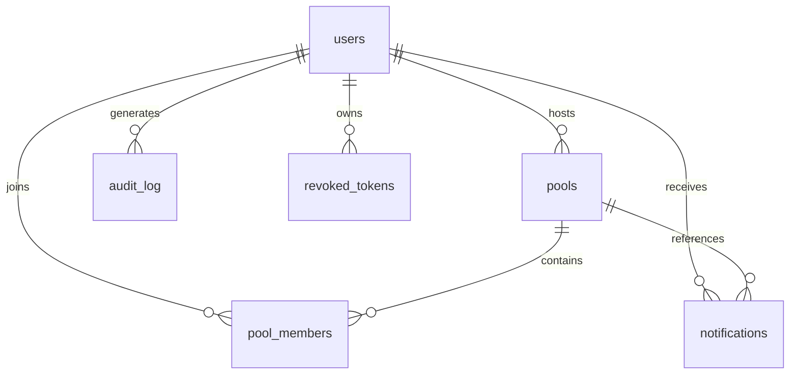

# Spliits — Technical Report

> **Project**: Spliits — Subscription Cost-Sharing Platform Backend  
> **Tech Stack**: Python 3.12 · FastAPI · PostgreSQL · SQLAlchemy 2.0 · Redis · Apache Airflow · Docker Compose · Alembic · Pydantic v2 · bcrypt · JWT (python-jose)  
> **Repository**: [github.com/patrickbatman118-hub/projects1](https://github.com/patrickbatman118-hub/projects1)

---

## 1. Project Overview

Spliits is a production-grade REST API backend for a subscription cost-sharing platform. Users create "pools" (shared subscription groups), invite members, manage join requests with host approval workflows, and receive real-time notifications. The system is fully containerized with a 7-service Docker Compose stack spanning the API server, PostgreSQL, Redis, and a complete Apache Airflow deployment (scheduler, webserver, init, and metadata database).

---

## 2. Architecture & Infrastructure

### 2.1 Containerized Multi-Service Deployment

The entire application is orchestrated via a single [compose.yml](./compose.yml) defining **7 services**:

| Service | Image | Purpose |
|---|---|---|
| `api` | Custom (Python 3.12-slim) | FastAPI application server via Uvicorn |
| `db` | postgres:18 | Primary OLTP PostgreSQL database |
| `redis` | redis:7-alpine | In-memory cache for JWT revocation lookups |
| `airflow-db` | postgres:18 | Dedicated Airflow metadata database |
| `airflow-init` | apache/airflow:2.9.1 | One-shot migration + admin user bootstrap |
| `airflow-scheduler` | apache/airflow:2.9.1 | DAG scheduler (LocalExecutor) |
| `airflow-webserver` | apache/airflow:2.9.1 | Airflow monitoring UI (port 8080) |

**Key infrastructure decisions**:
- Service dependency ordering with PostgreSQL health checks (`pg_isready`) ensures the API never starts before the database is accepting connections
- Airflow init runs as a one-shot (`service_completed_successfully` condition) to run `airflow db migrate` and create the admin user before scheduler/webserver launch
- Persistent Docker volumes (`postgres_data`, `airflow_db_data`) preserve data across container restarts
- Redis configured with `unless-stopped` restart policy for high availability

### 2.2 Dockerfile

The [Dockerfile](./Dockerfile) uses `python:3.12-slim` as the base image with `uv` as the package manager. The build installs dependencies from a lockfile (`uv.lock`) ensuring fully deterministic, reproducible builds across environments. The application is served via Uvicorn ASGI server.

---

## 3. Database Design & Query Optimization

### 3.1 Schema Design (6 Tables)

The relational schema is modeled using SQLAlchemy 2.0's modern `Mapped`/`mapped_column` declarative syntax:



| Table | PK | Key Columns | Constraints |
|---|---|---|---|
| [users](./app/models/users.py) | `user_id` (UUID, server-generated) | name, email, password, pfp, is_admin, disabled | `UNIQUE(email)` |
| [pools](./app/models/pools.py) | `pool_id` (UUID, server-generated) | title, description, total_cost, max_members, category, host_id (FK→users), is_active | `CHECK(total_cost > 0)`, `CHECK(max_members > 0)` |
| [pool_members](./app/models/pool_members.py) | `member_id` (UUID, server-generated) | pool_id (FK→pools), user_id (FK→users), host_id (FK→users), status (enum), role (enum) | `UNIQUE(pool_id, user_id)` |
| [notifications](./app/models/notifications.py) | `id` (serial) | receiver_id (FK→users), sender_id (FK→users), pool_id (FK→pools), content, is_read | Composite + partial indexes |
| [revoked_tokens](./app/models/jwt.py) | `jti` (UUID) | user_id (FK→users), revoked_at, reason | FK cascade on delete |
| [audit_log](./app/models/audit_log.py) | `id` (serial) | actor_id (FK→users), jti, action, resource_type, resource_id, decision, reason | FK SET NULL on delete |

**Notable schema features**:
- **Computed column**: `cost_per_member` is a PostgreSQL `GENERATED ALWAYS AS (total_cost / max_members)` computed column — the database auto-calculates per-member cost, eliminating application-level math and ensuring consistency
- **Enum types**: `pool_status_enum` (requested/accepted/rejected) and `pool_role_enum` (host/member) are native PostgreSQL ENUMs enforced at the database level
- **UUID primary keys**: All entity IDs use `gen_random_uuid()` server-side generation — no auto-increment leakage, safe for distributed systems
- **Timezone-aware timestamps**: All `created_at`/`updated_at` columns use `TIMESTAMP WITH TIME ZONE` with `server_default=text('now()')` to ensure consistent UTC timestamps regardless of client timezone
- **Cascading deletes**: Foreign keys use appropriate `CASCADE` and `SET NULL` on delete policies — deleting a user cascades to their pools, memberships, and tokens, while audit log entries are preserved with NULL actor

### 3.2 Index Optimization Strategy (Sub-Millisecond Query Targets)

The project implements a deliberate, query-driven indexing strategy across **9 Alembic migrations**, specifically targeting the hot-path queries to achieve sub-millisecond response times:

#### Partial Index on Active Pools (Descending by Creation Date)
```sql
CREATE INDEX idx_active_created_desc
ON pools (created_at DESC)
WHERE is_active = true;
```
- **Query served**: `GET /pools` — fetches latest 10 active pools ordered by `created_at DESC`
- **Optimization**: Partial index excludes inactive pools from the B-tree entirely, reducing index size. Descending sort order matches the `ORDER BY created_at DESC` clause, enabling an **index-only backward scan** instead of a full table sort

#### Composite Index on Notifications (Receiver + Descending Timestamp)
```sql
CREATE INDEX CONCURRENTLY idx_receiver_id_created_at
ON notifications (receiver_id, created_at DESC);
```
- **Query served**: `GET /notifications/read-all` — fetches last 30 notifications for the current user ordered by timestamp
- **Optimization**: Composite index covers both the `WHERE receiver_id = ?` filter and `ORDER BY created_at DESC` in a single index scan. Built `CONCURRENTLY` to avoid table-level locks on production data

#### Partial Index on Unread Notifications
```sql
CREATE INDEX idx_notifications_unread_by_user
ON notifications (receiver_id)
WHERE is_read = false;
```
- **Query served**: Unread notification count query (`WHERE receiver_id = ? AND is_read = false`)
- **Optimization**: Partial index only contains unread notifications — as users read notifications, rows drop out of the index, keeping it small and fast. For a typical user with 95%+ read notifications, this index is dramatically smaller than a full index

#### Standard B-tree Indexes
- `ix_pools_host_id` on `pools(host_id)` — optimizes "my pools" lookups by host
- `ix_pool_members_pool_id` on `pool_members(pool_id)` — optimizes member count joins and pool membership queries
- `ix_pool_members_user_id` on `pool_members(user_id)` — optimizes "already a member" checks
- `ix_revoked_tokens_user_id` on `revoked_tokens(user_id)` — optimizes per-user token revocation lookups

### 3.3 Query Design

The pool listing endpoint (`GET /pools`) uses a **subquery + aliased join pattern** to avoid the N+1 problem:

```python
pool_sub = (
    db.query(models)
    .filter(models.is_active == True)
    .order_by(models.created_at.desc())
    .limit(10)
    .subquery()
)
pool = aliased(models, pool_sub)
pools1 = (
    db.query(pool, func.count(pool_members.pool_id).label('member_count'))
    .outerjoin(pool_members, pool_members.pool_id == pool.pool_id)
    .group_by(...)
    .order_by(pool.created_at.desc())
    .all()
)
```

This executes as a **single SQL statement** that:
1. First narrows to the top 10 active pools via the partial index
2. Then LEFT JOINs with pool_members to count members per pool
3. Returns pools with member counts in one round-trip

---

## 4. Authentication & Authorization

### 4.1 JWT Token System (Access + Refresh Token Pattern)

Implemented in [authentication.py](./app/security/authentication.py):

- **Access tokens**: 55-minute expiry, contain `sub` (user_id), `scopes` (role array), `jti` (unique token identifier), `iat` (issued-at), `type: "access"`. Signed with HS256 via python-jose
- **Refresh tokens**: 15-day expiry, contain `sub` and `jti`, `type: "refresh"`. Stored separately and checked against the `revoked_tokens` table during refresh
- **Token refresh flow**: The `/refresh_token` endpoint validates the refresh token type, checks if the `jti` is revoked in the database, and issues a new access token — enabling seamless session extension without re-authentication
- **Password hashing**: Uses bcrypt with auto-generated salts via [hash_password.py](./app/security/hash_password.py). Passwords are hashed before storage; verification uses `bcrypt.checkpw()` for constant-time comparison

### 4.2 Redis-Backed Token Revocation

Implemented in [OAuth2.py](./app/security/OAuth2.py):

```
Access Token Revocation → Redis (TTL-based, auto-expires with token)
Refresh Token Revocation → PostgreSQL (persisted in revoked_tokens table)
```

**Why the hybrid approach**:
- **Access tokens** are checked on every authenticated request. Using Redis (`O(1)` key lookup, ~0.1ms) instead of a PostgreSQL query avoids a database round-trip on the critical path. The Redis key TTL is set to the token's remaining lifetime (`ex=remaining_seconds`), so revoked entries auto-evict when the token would have expired naturally — **zero garbage collection needed**
- **Refresh tokens** are checked infrequently (only during token refresh) and need durable persistence for audit compliance, making PostgreSQL the correct choice

**Fault tolerance**: Both `revoke_jti()` and `is_revoked()` catch `redis.exceptions.ConnectionError` and `redis.exceptions.TimeoutError`, returning HTTP 503 instead of crashing — the system degrades gracefully if Redis is unreachable

### 4.3 Role-Based Access Control (RBAC) with Scope-Based Authorization

The authorization system uses JWT scopes combined with a custom [PolicyEngine](./app/policy/policy_engine.py):

**Layer 1 — Scope Gate** (`require_scope`):
```python
class require_scope:
    def __init__(self, scope: str):
        self.scope = scope
    def __call__(self, current_user=Depends(get_current_user)):
        if self.scope not in current_user.scopes:
            raise HTTPException(status_code=403, detail=f"Missing required scope: {self.scope}")
        return current_user
```
- Acts as a **FastAPI dependency** that gates endpoint access based on JWT scopes
- Users get `["user"]` scope; admins get `["user", "admin"]`
- Used as: `Depends(require_scope('admin'))` on admin-only endpoints, `Depends(require_scope('user'))` on authenticated endpoints

**Layer 2 — Resource-Level Policy Engine**:
```python
class PolicyEngine:
    def check(self, db, action, resource_type, actor, Resource=None):
        # 1. Lookup registered rule for (resource_type, action)
        # 2. Verify actor has required scope
        # 3. Run ownership/relationship check lambda
        # 4. Log decision to audit_log table
        # 5. Return (allowed: bool, reason: str)
```

Policies are registered declaratively in [policies.py](./app/policy/policies.py):
```python
policy_engine.register("pool", "update", Rule(
    scope="user",
    check=lambda actor, pool: actor.user_id == pool.host_id
))
```

This means: "To update a pool, you need the `user` scope AND you must be the pool's host." The two-layer design separates **access control** (can you reach this endpoint?) from **authorization** (can you act on this specific resource?).

### 4.4 Audit Logging

Every policy decision is recorded in the [audit_log](./app/models/audit_log.py) table via [log.py](./app/log.py):

| Column | Purpose |
|---|---|
| `actor_id` | Who performed the action (FK→users, SET NULL on delete) |
| `jti` | Which JWT token was used (enables token-level tracing) |
| `action` | What was attempted (e.g., "update") |
| `resource_type` | What type of resource (e.g., "pool") |
| `resource_id` | Which specific resource (e.g., pool UUID) |
| `decision` | "allowed" or "denied" |
| `reason` | Why (e.g., "ownership_check_failed", "missing_scope:admin") |
| `created_at` | When (timezone-aware timestamp) |

This provides a complete, immutable audit trail for security reviews and compliance.

---

## 5. API Design & Business Logic

### 5.1 Endpoint Architecture (5 Router Modules)

| Router | Endpoints | Key Features |
|---|---|---|
| [users.py](./app/routers/users.py) | `/signup`, `/user/{id}`, `/deleteuser`, `/updateuser`, `/me` | Registration, profile CRUD, scoped access |
| [authentication.py](./app/security/authentication.py) | `/login` (GET+POST), `/refresh_token`, `/logout` | OAuth2-compatible login form, dual-token lifecycle |
| [pools.py](./app/routers/pools.py) | `/createpool`, `/deletepool/{id}`, `/updatepool/{id}`, `/pools`, `/pool/mypools`, `/pool/{id}` | Pool CRUD with rate limiting, owner-only delete |
| [requests.py](./app/routers/requests.py) | `/user/sendrequest/{pool_id}`, `/user/getrequest`, `/host/acceptrequest/{request_id}`, `/user/deleterequest/{request_id}`, `/host/pools/{pool_id}/requests`, `/memberships/pools/{pool_id}/leave`, `/memberships/pools/{pool_id}/members/{user_id}` | Full join-request lifecycle, host approval workflow, member removal |
| [admin.py](./app/routers/admin.py) | `/users` | Admin-only user listing, gated by `require_scope('admin')` |
| [notifications.py](./app/routers/notifications.py) | `/notifications/read-all` | Paginated notifications with unread count |

### 5.2 Rate Limiting on Pool Creation

The `POST /createpool` endpoint implements **application-level rate limiting** without external middleware:

```python
count = db.query(func.count(models.pool_id)).filter(
    models.host_id == current_user.user_id,
    models.created_at >= func.now() - text("interval '30 days'")
).scalar()

countday = db.query(func.count(models.pool_id)).filter(
    models.host_id == current_user.user_id,
    models.created_at >= func.now() - text("interval '1 day'")
).scalar()
```

- **Monthly limit**: Max 3 pools per user per 30-day rolling window
- **Daily limit**: Max 3 pools per user per day
- Returns `HTTP 429 Too Many Requests` when exceeded
- Computed server-side using PostgreSQL interval arithmetic — not dependent on application state

### 5.3 Transactional Join Request Workflow

The join request flow in [requests.py](./app/routers/requests.py) uses atomic transactions:

1. User sends request → creates `pool_members` row (status: `requested`) + notification to host — **both in same transaction**
2. Host approves → updates member status + creates notification to requester — **both in same transaction**
3. If any step fails → `db.rollback()` ensures no partial state

Guard conditions prevent:
- Hosts from requesting to join their own pool
- Duplicate join requests (checked via existing membership query)
- Re-processing already accepted/rejected requests (status conflict detection, returns `HTTP 409`)

### 5.4 Request/Response Validation (Pydantic v2)

Schemas in [schemas/](./app/schemas) use Pydantic v2 with:
- `EmailStr` for email format validation
- `Field(min_length=8)` for password minimum length
- `Field(gt=0)` for positive cost validation, `Field(gte=2)` for minimum member count
- `model_validator(mode='after')` for cross-field password confirmation
- `PoolCategory` enum for type-safe category selection (13 categories)
- `from_attributes = True` config for seamless ORM-to-response serialization
- `exclude_unset=True` in `model_dump()` for partial updates (PATCH semantics)

### 5.5 Custom Exception Handling

The application defines **6 custom exception classes** in [exception.py](./app/exception.py), each registered with a FastAPI exception handler in [app.py](./app/app.py) returning consistent JSON error responses:

| Exception | HTTP Status | Scenario |
|---|---|---|
| `EmailAlreadyExists` | 409 | Duplicate signup |
| `NoUserExists` | 404 | User not found |
| `InvalidCredentials` | 401 | Bad login / expired token |
| `NoPoolExist` | 404 | Pool not found |
| `AlreadyInThePool` | 409 | Duplicate join request |
| `ForbiddenUser` | 403 | Policy engine denial |

---

## 6. ETL Pipeline (Apache Airflow)

### 6.1 DAG Design

The ETL pipeline ([ETL_DAG.py](./ETL_DAG.py)) is orchestrated as an Airflow DAG with three sequential tasks:

```
extract_task >> transform_task >> load_task
```

- **Schedule**: Daily cron execution
- **Retry policy**: 2 retries with 5-minute delay between attempts
- **Catchup disabled**: Prevents backfill execution of missed runs

### 6.2 Extract Phase

Reads from the OLTP source database using raw SQL with explicit column selection and UUID casting:

```sql
SELECT user_id::text, name, email, is_admin, disabled, created_at FROM users
SELECT pool_id::text, title, category, total_cost, max_members, cost_per_member, host_id::text, is_active, created_at FROM pools
SELECT member_id::text, pool_id::text, user_id::text, host_id::text, status, role, joined_at FROM pool_members
```

Data is serialized as JSON via Airflow's XCom mechanism for inter-task communication.

### 6.3 Transform Phase

Applies the following transformations using Pandas:

| Transformation | Purpose |
|---|---|
| `account_age_days` | Derived from `(now - created_at).days` |
| `pool_age_days` | Derived from `(now - created_at).days` |
| `days_since_joined` | Membership tenure calculation |
| `is_accepted` | Boolean flag from status enum |
| `is_host` | Boolean flag from role enum |
| `total_members` | Aggregated count of accepted members per pool |
| `fill_rate` | `total_members / max_members` — pool utilization metric |
| `is_full` | Boolean flag when `fill_rate >= 1.0` |
| `dropna()` | Data quality enforcement on required fields |

### 6.4 Load Phase (Star Schema Warehouse)

Loads into a `warehouse` schema using an **upsert pattern**:

1. Bulk-loads into a temporary staging table (`_temp_{table}`)
2. Executes `INSERT ... ON CONFLICT ({pk}) DO UPDATE SET ...` to merge into dimension/fact tables
3. Drops the staging table

**Warehouse tables**:
- `warehouse.dim_users` — User dimension (SCD Type 1 via upsert)
- `warehouse.dim_pools` — Pool dimension
- `warehouse.fact_memberships` — Membership fact table
- `warehouse.fact_pool_summary` — Aggregated pool analytics (TRUNCATE + reload)

---

## 7. Database Migrations (Alembic)

The project tracks **9 sequential Alembic migrations** demonstrating incremental, production-safe schema evolution:

| # | Migration | Change |
|---|---|---|
| 1 | `db283cc92d4a` | Initial schema — users, pools, pool_members, notifications + B-tree indexes |
| 2 | `3ca9738216db` | Add `host_id` FK to pool_members |
| 3 | `1b9762c0c603` | Add `revoked_tokens` table for JWT revocation |
| 4 | `75ca3a594ee7` | Add `is_admin` column to users (RBAC) |
| 5 | `82128b2f4573` | Add `pool_id` FK to notifications |
| 6 | `02bd9aecd63d` | Add `audit_log` table |
| 7 | `d80f81e6efcd` | **Concurrent** composite index on notifications (receiver_id, created_at DESC) |
| 8 | `f8d9a6d606e4` | Partial index on unread notifications |
| 9 | `d2b20526369b` | Partial index on active pools (created_at DESC) |

> [!IMPORTANT]
> Migration #7 uses `postgresql_concurrently=True` with `autocommit_block()` — this builds the index without acquiring an exclusive table lock, allowing reads and writes to continue during index creation. This is a production-critical technique for zero-downtime deployments on tables with high write throughput.

---

## 8. Mock Data & Transaction Testing

The [mock_data.py](./mock_data.py) script is a comprehensive data generation and transaction testing tool:

### 8.1 Scale & Performance

- **10,000 users, 1,500 pools, 20,000 notifications** generated using Faker
- **Performance optimization**: Reuses a single bcrypt hash for all mock users (individual hashing at 200-300ms/hash would take ~50 minutes for 10K users)
- **Chunked bulk insert**: Uses SQLAlchemy Core-level `insert()` in 2,000-row chunks (`executemany()`) instead of ORM `add()` for orders-of-magnitude faster inserts
- **Client-side UUID generation**: All primary keys generated in Python before insert — no flush-and-read-back needed

### 8.2 Transaction Scenarios

The script implements **4 deliberate transaction scenarios**:

| Scenario | Tests |
|---|---|
| Happy path | Full bulk insert in single transaction — commit |
| Duplicate email | `UNIQUE` constraint violation → entire chunk rolls back |
| Duplicate membership | Composite `UNIQUE(pool_id, user_id)` constraint → rolls back |
| Savepoint | `session.begin_nested()` — inner failure rolls back to savepoint, outer transaction commits successfully |

---

## 9. Logging & Observability

- **Application logging**: Python's `logging` module configured in [app.py](./app/app.py) — writes to `app.log` with timestamp, level, and message format
- **Structured audit logging**: Every policy engine decision is persisted to `audit_log` with actor, action, resource, decision, and reason — queryable for security analysis
- **Airflow observability**: DAG execution history, task duration, retry count, and failure logs available via Airflow Web UI at port 8080

---

## 10. Technology Summary

| Category | Technology | Usage |
|---|---|---|
| **Language** | Python 3.12 | Application runtime |
| **Framework** | FastAPI | Async-capable REST API framework |
| **ORM** | SQLAlchemy 2.0 | Modern mapped_column declarative syntax |
| **Database** | PostgreSQL 18 | OLTP + warehouse, computed columns, partial indexes, ENUMs |
| **Cache** | Redis 7 | JWT revocation O(1) lookups with TTL auto-expiry |
| **Migrations** | Alembic | 9 versioned migrations, concurrent index support |
| **Auth** | python-jose + bcrypt | HS256 JWT signing, bcrypt password hashing |
| **Validation** | Pydantic v2 | Request/response schemas with cross-field validators |
| **ETL** | Apache Airflow 2.9.1 | Scheduled Extract-Transform-Load with star schema warehouse |
| **Data Processing** | Pandas | ETL transformations, aggregations |
| **Container** | Docker + Docker Compose | 7-service orchestration with health checks |
| **Package Manager** | uv | Deterministic lockfile-based dependency resolution |
| **Server** | Uvicorn | ASGI server with hot-reload for development |

---

